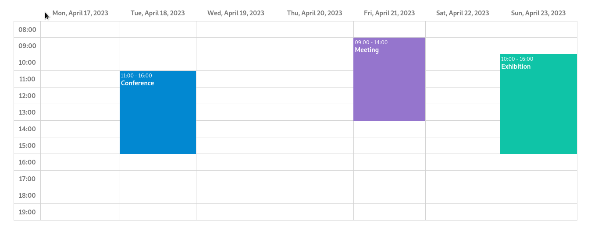

# @mormat/react-ui-scheduler

React UI component for rendering a scheduler



- [Demo](https://mormat.pagesperso-orange.fr/react-ui-scheduler/)

## Installing

```
npm install @mormat/react-ui-scheduler
```

## Import

This package contains a `<Scheduler />` component that can be imported like this
```js
import Scheduler from '@mormat/react-ui-scheduler'
```


## Usage

```js
import React     from 'react'
import ReactDOM  from 'react-dom/client'
import Scheduler from '@mormat/react-ui-scheduler'

function App() {

    const schedulerEvents = [
        {
            label:     "meeting",
            date:      "2023-04-18",
            startTime: "09:00",
            endTime:   "12:00",
            color:     "white",
            backgroundColor: "rgb(2, 136, 209)"
        },
        {
            label:     "conference",
            date:      "2023-04-20",
            startTime: "10:00",
            endTime:   "18:00",
            color:     "white",
            backgroundColor: "#9575cd"
        }
        // add more events here ...
    ]
    
    const onEventChange = (schedulerEvent) => {
        console.log("the following event has been changed", schedulerEvent);
    }

    return (
        <Scheduler events = { schedulerEvents } 
                   onEventChange = { onEventChange }
                   currentDate = "2023-04-17" 
        />
    )

}

ReactDOM.createRoot(document.getElementById('root')).render(
  <React.StrictMode>
    <App />
  </React.StrictMode>,
)
```

## Styling

The package contains a default css script that can be include like this
```
import '@mormat/react-ui-scheduler/public/scheduler.css';
```
