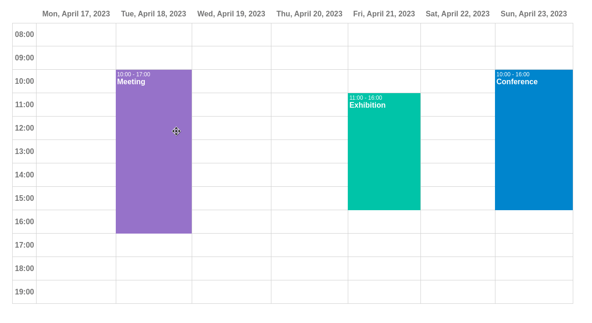

# @mormat/react-ui-scheduler

React UI component for rendering a scheduler



- [Demo](https://mormat.github.io/react-ui-scheduler/)

## Installing

```
npm install @mormat/react-ui-scheduler
```

## Import

Import the `<Scheduler />` component like this :
```js
import Scheduler from '@mormat/react-ui-scheduler'
```

## Usage

```js
import React     from 'react'
import ReactDOM  from 'react-dom/client'
import Scheduler from '@mormat/react-ui-scheduler'

function App() {

    const schedulerEvents = [
        {
            label:     "meeting",
            date:      "2023-04-18",
            startTime: "09:00",
            endTime:   "12:00",
            color:     "white",
            backgroundColor: "rgb(2, 136, 209)"
        },
        {
            label:     "conference",
            date:      "2023-04-20",
            startTime: "10:00",
            endTime:   "18:00",
            color:     "white",
            backgroundColor: "#9575cd"
        }
        // add more events here ...
    ]
    
    const onEventChange = (schedulerEvent) => {
        console.log("the following event has been changed", schedulerEvent);
    }

    return (
        <Scheduler events = { schedulerEvents } 
                   onEventChange = { onEventChange }
                   currentDate = "2023-04-17" 
                   minHour = "07:00"
                   maxHour = "21:00"
        />
    )

}

ReactDOM.createRoot(document.getElementById('root')).render(
  <React.StrictMode>
    <App />
  </React.StrictMode>,
)
```

## API
Available props for this component are :
* `events`: an array of objects representing the events to display in the scheduler. Each object must contain the properties below :
    - `label`: a string containing the description of the event
    - `date`:  date of the event (string format YYYY-MM-DD)
    - `startTime`:  starting time of the event (string format HH:MM)
    - `startTime`:  ending time of the event (string format HH:MM)
* `currentDate`: date of the week to display in the scheduler (string format YYYY-MM-DD)
* `minHour`: the minimum hour in the Y-axis (string format HH:MM)
* `maxHour`: the maximum hour in the Y-axis (string format HH:MM)
* `locale`: specify which i18n locale to use when formatting dates in the header (for instance 'en-US', 'fr-FR', etc.). It's the same locale string used by the javascript class [Intl.DateTimeFormat](https://developer.mozilla.org/fr/docs/Web/JavaScript/Reference/Global_Objects/Intl/DateTimeFormat/DateTimeFormat)
* `draggable`: if sets to true, enable drag and drop on scheduler events (default is true)
* `rowHeight`: sets the height of a row (integer or a string like '50px')


## Styling

The package contains a default css script that can be included like this
```
import '@mormat/react-ui-scheduler/public/scheduler.css';
```

An ordinary HTML table tag is used for rendering the scheduler so it can be easily customized with a css script. 
> Note that the height of the `<tr/>` element in the `<tbody/>` section must remain the same for every rows as it is used to compute the position of a scheduler event.